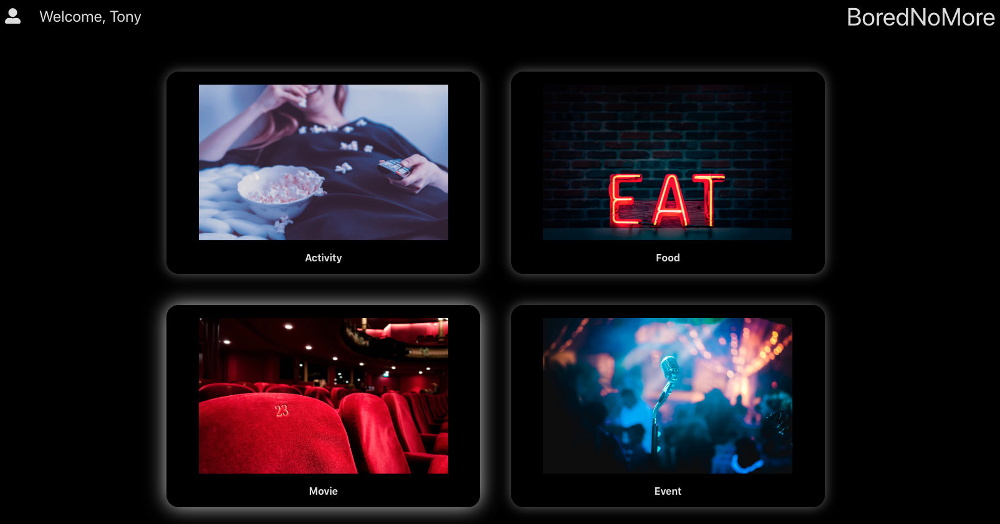
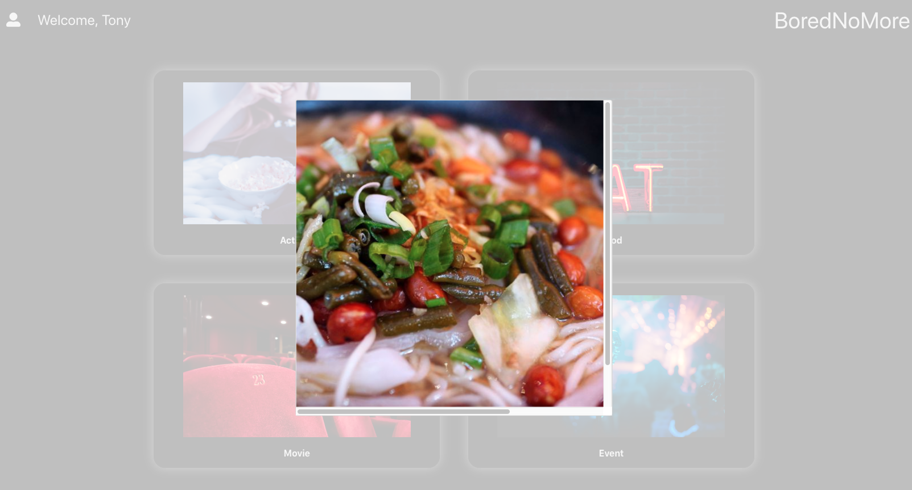
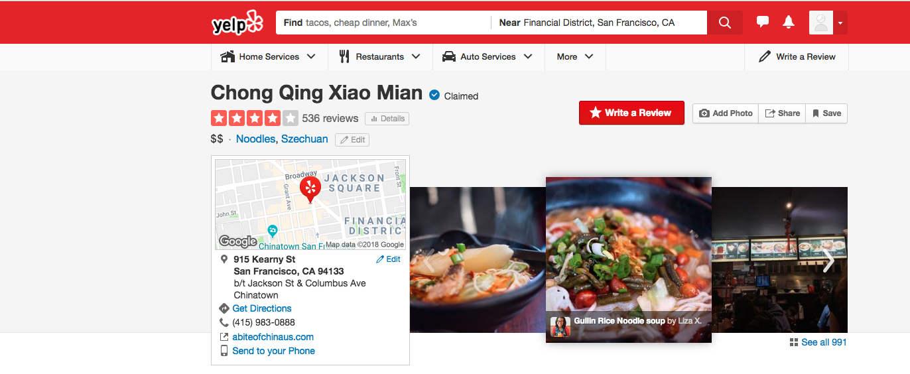

# BoredNoMore
[live demo](https://borednomore.herokuapp.com/#/)

BoredNoMore is a tool that curates activities for users based on four categories: Streams, Movies, Live Events, and Restaurants.

Users first take a quiz to determine their interests. After completing the quiz, users are given the option to create an account.

Based on their interests, BoredNoMore will request relevant information from TicketMaster and Yelp and will use its sophisticated algorithm to determine one optimal choice for each of the four categories.

Users may click on the returned picture to open its third party site in another tab.

